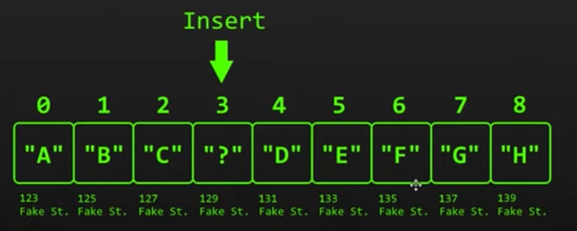
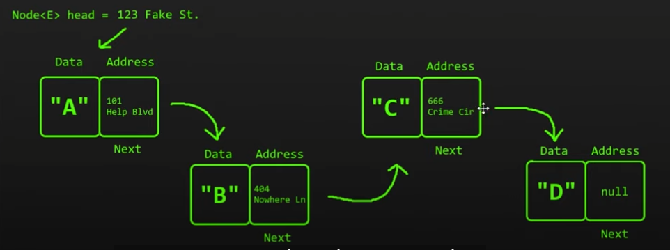
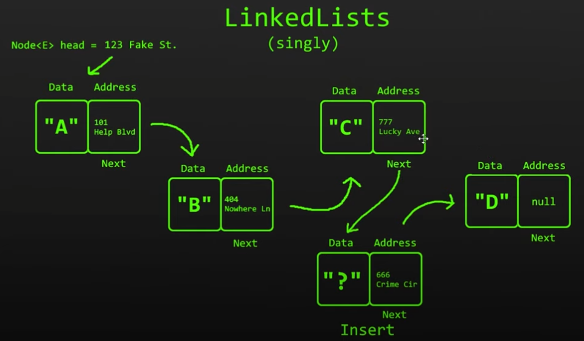
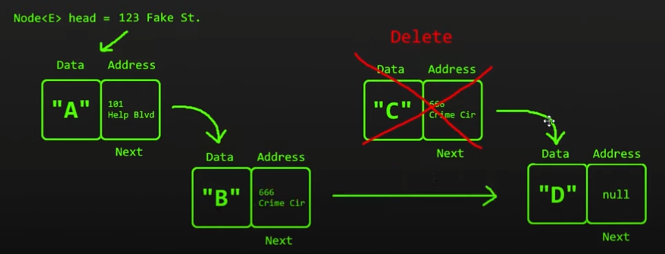

[Return to contents](https://github.com/devychen/JavaStudyTrack/tree/main/README.md)

# LinkedList

[Learn Linked Lists in 13 minutes](https://www.youtube.com/watch?v=N6dOwBde7-M) (Also the images sources)

### VS ArrayList
- ArrayList are not so great at <ins>inserting/deleting elements</ins> esp when 
elements are closer to the beginning of the array, as it involves shifting of elements.

- LL on the other hand has that advantage.
- LL is made up of a long chain of nodes, starting from **head** to reach the tail with a value of `null`.
- A **singly LL**: there are single links to each node.
  
- For each node: 
  - Contains two parts: **data** to be stored, **pointer** i.e. address to the next node.
  - No index, but each contains <ins>an address to where the next node is located</ins>.
  - Nodes are not continuous, could be anywhere within the computer memory.
- Inserting
  - Inserted node points to the next node inline using the previous node's pointer. 
  - Previous node's pointer changes and points to the new inserted node.
  
- Deleting
  - Previous node's pointer changes to the deleted node's pointer and points to the next node inline.
  
- But LinkedList are <ins>bad at searching</ins> as there is no index.
  - Instead, we need to walk from the head to tail to locate it.
  - Thus introduce the **doubly LL**: 2 addresses stored in each node, one for the next, one for the previous node.
    - Advantages: can traverse from H-T and also T-H.