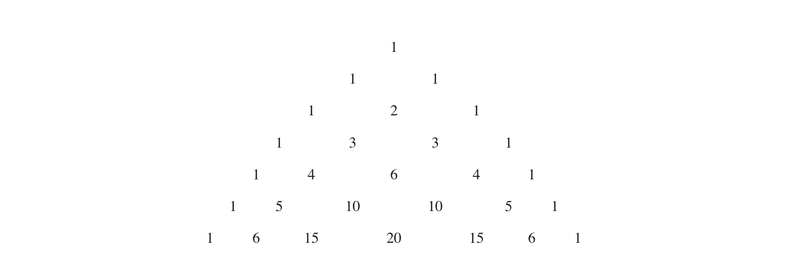

# Recursion - handshake, Pascal's triangle

# Before you start
Create a project for this selftest with a source file called SelfTest4.java, and a junit test file called SelfTest4Test.java.

# Exercise 1
There are n people in a room, where $n >= 0$.  Each person shakes hands once with everyone else in the room.  What is the total number of handshakes?

To help understand the problem, imagine the people entering the room one at a time:

If there is nobody in the the room, there are no handshakes.
If one person enters the room, there are no handshakes (a person does not shake hands with themself!).
When a 2nd person enters the room, there is 1 handshake.
When a 3rd person enters the room, they shake hands with the other two, so the number of handshakes is 2 + the number of handshakes that took place when there were only 2 people in the room (2 + 1 = 3).
When a 4th person enters the room, they shake hands with the other three, so the number of handshakes is 3 + the number of handshakes that took place when there were only 3 people in the room (3 + 3 = 6).
When a 5th person enters the room, they shake hands with the other four, so the number of handshakes is 4 + the number of handshakes that took place when there were only 4 people in the room (4 + 6 = 10).

Write a <ins>static recursive method handshake</ins> to determine the number of handshakes for the input parameter n, and a junit test method that checks for the correct results.

The handshake method should throw an `IllegalArgumentException` if n<0.  An IllegalArgumentException is a runtime exception, defined within the java language.  You do not need to import anything to throw it.  Runtime exceptions do not have to be caught or declared to be thrown.  This means that you do NOT need to put the "throws IllegalArgumentException" in the method heading.  When calling a method that throws a runtime exception, the method call does not have to be placed within a try/catch block.  Your junit test, however, should make sure that the exception is thrown when it should be.

# Exercise 2
Pascal's triangle is a triangular arrangement of numbers whose outer edges consist of 1s and each of whose inner elements is the sum of the two numbers immediately above it to its right and left:



Write a <ins>static recursive method</ins> pascal which returns the row of pascal's triangle in an array of ints.  Let the row numbers start at 0, so that pascal(3) returns the int array {1,3,3,1}, where the elements in positions 0 and 3 are defined to be 1, the first 3 is generated by adding the elements at positions 0 and 1 in the previous row, and the second 3 is generated by adding the elements at positions 1 and 2 in the previous row.

- for the pascal method, use the signature: public static int[] pascal(int n).
- throw an IllegalArgumentException if n<0
- Note that you will need a loop to generate the current row from the previous row.  The first and last elements of the returned array are 1, and the elements in between are generated by adding elements from the previous row.
- Add the following test method to your junit test class to ensure that your method works:
```java
/**
* Test pascal.
*/

public void testPascal() {        
    try {
    SelfTest3.pascal(-1);
    fail(); 
    }
    catch (IllegalArgumentException e) {
        // good
    }

    int[] result; 
    int[][] expected = {
            {1},
            {1,1},
            {1,2,1},
            {1,3,3,1},
            {1,4,6,4,1},
            {1,5,10,10,5,1},
            {1,6,15,20,15,6,1}
    };

    for (int row=0; row<expected.length; row++) {
        result = SelfTest3.pascal(row);
            
        for (int i=0; i<expected[row].length; i++) {
            assertEquals("row: " + row + " element: " + i,
                    expected[row][i], result[i]);
        }
    }
}
```

---

Last modified: Wednesday, 26 April 2017, 4:22 PM