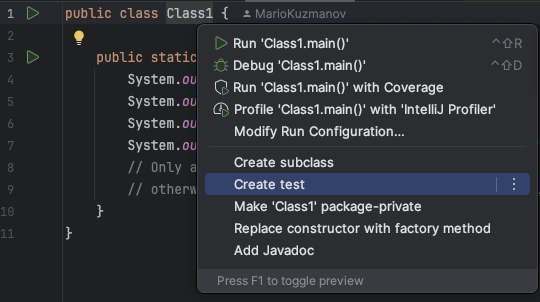
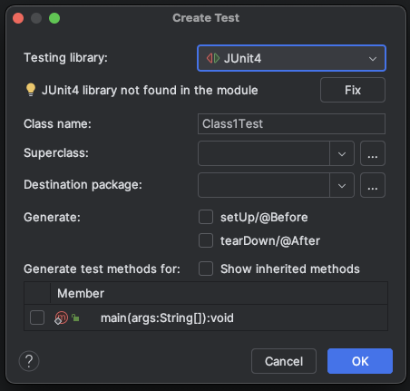
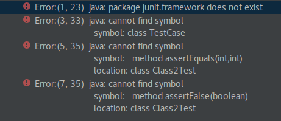
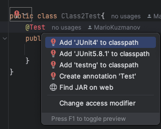
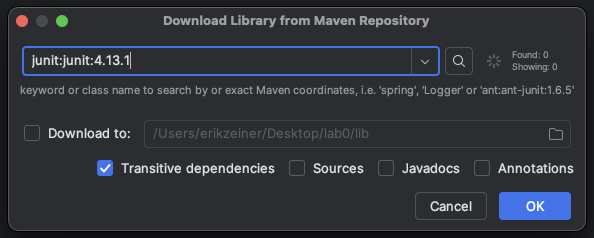
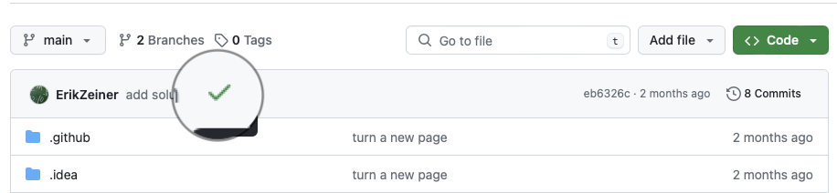

[](https://classroom.github.com/a/oHYrkZo4)
# IntelliJ
Starting this semester we will use the programming environment IntelliJ instead of Vscode. IntelliJ has a lot of useful tools that will help you to improve your code and will make your life a lot easier (finding typos, auto completion, methods suggestion, Auto indention, Debugger...). However IntelliJ is a little bit different to handle than Vscode, therefore we will give you hereby a short Introduction. During the lab you will have the possibility to ask questions about IntelliJ, so try to get at least a bit familiar with it till then.

On Friday we will:
1) Download IntelliJ (see info below)
2) Create a new project from GitHub lab0
3) Add the required information to Class1 and run it (you might have to add 'JUnit4' to classpath first)
4) Run the test for Class2 (it will fail) and change Class2 in a way that the test passes
5) Commit and push your changes to Class1 and Class2


## Installing IntelliJ Ultimate

**You are expected to use the Ultimate version which is available to you with the free educational license.**

1. Go to https://www.jetbrains.com/community/education/#students
2. Click on **Apply**
3. Fill in the form and make sure you use your **university e-mail**
4. Follow the instructions and download IntelliJ IDEA Ultimate

## Basics in a nutshell (for more detailed information take a look at 'Setting up IntelliJ')

### Create new project 
File -> new project -> Project SDK: 1.8 -> Create project from template -> Enter project name: lab0 -> finish

### Create project from existing source (for example GitHub) 
Clone the Github repository as usual -> IntelliJ: File -> new project from existing sources -> choose lab0-myGitHubName as source -> keep clicking 'next' -> finish


### Create a new java class
On the left sidebar: lab0-myGitHubName -> src -> right click -> new Java Class

If there is no left sidebar: View -> tools window -> project or click at 'Project' on the left

If there is no src: lab0-myGitHubName right click -> new Directory -> Enter new directory name: src -> Mark directory as Sources root


### Tests
**To maintain the correct project structure all tests have to be in lab0-myGitHubName -> test** 

If there is no test directory -> left sidebar: lab0-myGitHubName right click -> new Directory -> Enter new directory name: test -> Mark directory as -> Test Sources root

#### Create a new test
Click on the name of the class you want to create the test for -> alt + enter -> Create test -> Testing library: Junit4

It is possible that IntelliJ can't resolve 'junit' and 'TestCase'. 
If that's the case: click on TestCase -> alt + enter -> Add  'JUnit4' to classpath -> ok

**Make sure to call your test methods `testMethodName` otherwise IntelliJ won't recoginize them as test methods and therefore not run them.**


# Setting up IntelliJ

Transitioning to an IDE such as IntelliJ can be frustrating since there are many features and quirks to become familiar with, but once you're comfortable with it, it will make your life much easier and will speed up the coding process, much to your benefit. We have prepared this exercise for you to complete before the semester begins to help ensure a smooth transition. We have tried to outline most of what you need to know in this repo.

## IntelliJ project structure

All IDE projects need to have a defined project structure. Usually, it looks something like this:

~~~
project-name/
    ↳ src/
        Class.java
        AnotherClass.java
    ↳ test/
        ClassTest.java
        AnotherClassTest.java
    ↳ out/
        Class.class
        ClassTest.class
        AnotherClass.class
        AnotherClassTest.class
    ↳ .idea/
        File.iml
        File.xml
    .gitignore
    README.md
~~~

As you can see, source code (```src/```) is separated from compiled classes (```out/```) which keeps everything organized. JUnit tests are placed in their own folder (```test/```). The ```.idea/``` directory is for local preferences and project dependency information, and will be automatically generated each time you open a project in IntelliJ. This folder shouldn't be shared or included in your submissions; they will usually be excluded in the .gitignore file anyway so you don't have to worry about this. Note: the .gitignore and README.md files are not IDE-specific files, they are for GitHub, but you should keep in mind that they must always be included in your labs, in the main directory.

If your project does not conform to this structure, you will not be able to compile and run your code.


## Defining a new project
Most projects will already be created and defined for you this semester and you will only need to clone them from GitHub, but if you ever need to create a new project from scratch for any reason, there are some steps you need to know.

First, you need to define the project SDK, or Software Development Kit. For the purposes of this class, that just means the JDK or Java Development Kit, version 1.8. Please be sure you have downloaded and are using this version now because we will be using features not present in 1.7 later this semester.

If you create a new project in IntelliJ, it will create a ```src/``` directory for you, which is where your java classes will reside. If you copy/paste a ```src/``` folder into your project folder manually, you will need to define that directory as the source code root yourself. To do this, in the IntelliJ left sidebar, simply right-click the ```src/``` folder and select: Mark Directory As -> Sources Root.

The same applies if you want to include JUnit tests. If you create a folder manually and copy/paste it into your project folder, you need to right-click the ```test/``` folder and select Mark Directory As -> Test Sources Root. If you want to create a new JUnit test file for any particular class, and a test folder has not yet been created, an easier way would be to open the class file as normal, put your cursor on the class name, and press ```ALT``` + ```ENTER``` -> Create Test. This will automatically generate a new ```test/``` directory for you. **Note: You must use JUnit 4 for all tests in this class.**

  



To make sure you understand how the project directory structure works, try to convert one of your labs or selftests from Java 1 into this format. Be sure to choose one that had JUnit tests so you can also define a test sources root.

**Here's a great video which guides you through creating a project in Intellij:** https://www.youtube.com/watch?v=c0efB_CKOYo

## Defining the project SDK

You might run into the problem of your Project SDK not being defined. SDK is basically a collection of libraries and tools for developing Java applications. You have to set the project SDK in order to be able to access libraries, run your classes and such. 

**Here are some instructions on how to set the SDK:** https://www.jetbrains.com/help/idea/sdk.html

Quick summary: 
```File``` - ```Project Structure``` - ```Project Settings``` - ```Project``` - ```Project SDK``` - choose the JDK from the dropdown menu. 

If there is nothing in the dropdown menu, go to ```Project Structure``` - ```Platform Settings``` - ```SDKs``` - ```JDK``` home path and choose the path to the folder where your JDK is installed (in my case it is C:\Program Files\Java\jdk1.8.0_151). Set your JDK home path to this path. Click OK. It should be working now.

## Running a class

As long as the ```main``` class is in the ```src/``` folder (which should be marked as sources root), you will be able to run it in many ways: right clicking anywhere in the code and selecting Run 'Class', clicking the green Run icon, or by defining your own custom keyboard shortcut.

https://www.jetbrains.com/help/idea/running-applications.html

## Configuring JUnit libraries for test cases 

If you are getting an error message like ```Error:(1, 24) java: package org.junit does not exist``` when running a junit test case, you have most likely not added the junit jar file path 
to the libraries of your project. 

https://www.jetbrains.com/help/idea/configuring-testing-libraries.html







## Intention actions

One of the most helpful tools IntelliJ offers is intention actions. In a nutshell, whenever the IDE has a suggestion for you to optimize or complete your code, a lightbulb or underline will appear. If you put your cursor over the underline and click ```ALT (or option)``` + ```ENTER```, or click the lightbulb, it will display suggestions for you to improve your code.

You can also use intention actions when your project is missing a dependency, a method is not defined, and various other cases. The problem code will appear in red. Place your cursor over the red text, press ```ALT (or option)``` + ```ENTER```, and examine the suggestions to determine the best one to resolve the issue.


## Gradle project & Automatic testing on GitHub

This semester your lab files will also include a few new files and folders used by Gradle - a build automation tool that allows for the tests to also be automatically run when you push to GitHub.
This means when you push your code, GitHub will automatically run all the test files in your project. You can see that you passed all the tests on the page for the given repository; it will have a green check mark next to the latest commit. If not all of the tests passed, you will see a red cross.
You can click on either of these icons to see more detailed information about the results of the tests. Gradle already tells IntelliJ about the version of JUnit necessary, so you should not need to import JUnit. You will learn more about build automation tools later this semester.

**It is important not to modify any of the Gradle related files in any way. You also mustn't modify the test file names and method names.**



